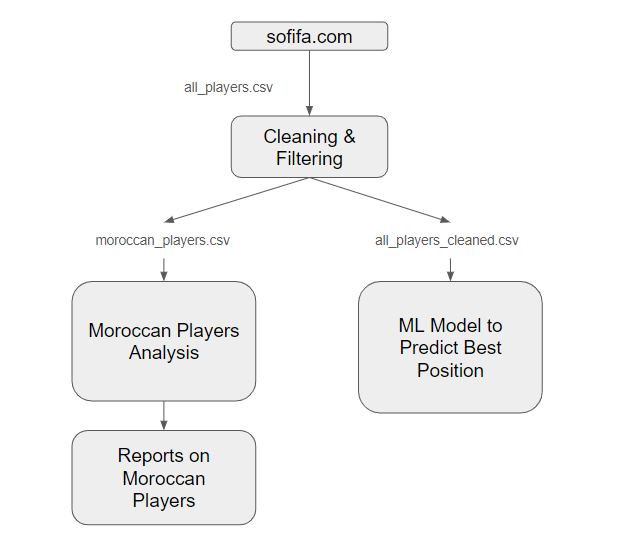

# FIFA-Player-Analysis

## Overview

This project aims to analyze FIFA player data from sofifa.com, focusing specifically on Moroccan players and predicting the best positions for players using machine learning models.

- By analyzing the detailed statistics of Moroccan national team players, the project provides a comprehensive understanding of each player's strengths and weaknesses. This allows coaches and analysts to make informed decisions about player development, training focus, and match strategies.
- The machine learning model predicts the best position for players based on their attributes and performance data. This ensures that players are utilized in roles where they can perform optimally, leading to better team performance and individual career development.

## Project Architecture

Below is the architecture of the project:

## Project structure 

1. **Data Sources**:
   - Raw data from `sofifa.com` is saved as `all_players.csv`.

2. **Data Processing**:
   - Cleaning and filtering the data to create:
     - `moroccan_players.csv`: Contains cleaned data of Moroccan players.
     - `all_players_cleaned.csv`: Contains cleaned data of all players.

3. **Data Exploration and Analysis** :
   - Explore and analyze the data of Moroccan players : `Moroccan_players_analysis.ipynb`
   - Generate reports on Moroccan players : `Moroccan_Players_Analysis_Report.pdf`

4. **Machine Learning Model** :
   - Use cleaned data of all players to build an ML model that predicts the best position for a football player based on their characteristics : `best_position_predictor.ipynb`
